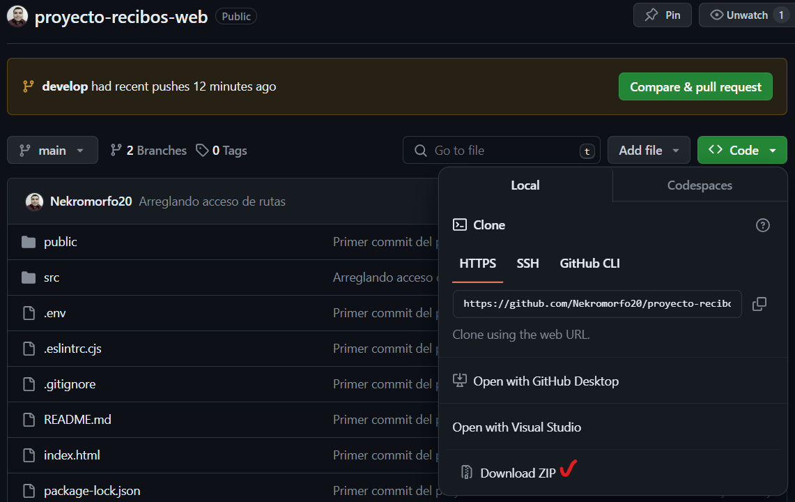
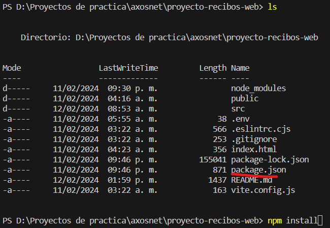

# "Proyecto recibos Web"
*Evaluación ténica de ingreso R&D para Axosnet.*

## Descrición:
Evaluación técnica para Axosnet, proyecto administración de recibos.

Este es un proyecto Web que apoya a un usuario con la administración de sus recibos (utilizando un CRUD).

## Desarrollado por:
Ing. Alan Eduardo Aguilar Guerrero (Desarrollador Jr.)

## Fecha:
Lunes 12 de Febrero del 2024

## Principales tecnologías:
* react js + Vite v18.2.55
* bootstrap v4.6.2
* axios v1.6.7

## Instrucciones para instalación:
1. Descargue este proyecto instalando la herramient "Git" y utilizando el comando `git clone https://github.com/Nekromorfo20/proyecto-recibos-web.git` en una terminal desde su computadora y mientras se encuentre en el directorio donde guste colocar el proyecto. Tambien puede descargar el proyecto como archivo ".zip" seleccionando el botón "<> Code" y seleccionando la opción "Download ZIP".

2. Abra una terminal en su computadora y coloque la dirección del directorio donde el proyecto fue descargado, coloquese a nivel raíz del proyecto (donde pueda visualizar el archivo "package.json") y una vez ubicado ejecute el comando `npm install` para instalar todas las dependencias.

3. Una vez instaladas las dependencias ejecute el comando `npm run dev` para iniciar el proyecto.

## Usuarios de prueba:
Usuario: alan  
Contraseña: admin123

Usuario: juan  
Contraseña: admin123